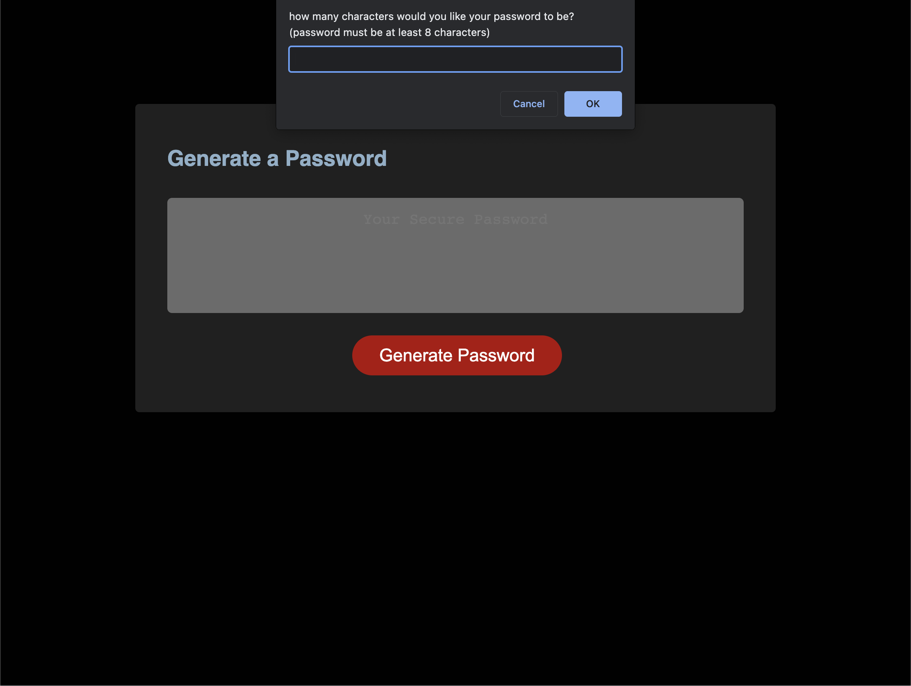

# 03 JavaScript: Password Generator

## Description

This project served to fulfill the user story which requested a password generator that enables one to generate a random, secure password utilizing various criteria so long as the password is between 8 to 128 characters long, using lowercase, uppercase, and special characters, as well as numbers. These days, advancements in technology has enabled incredible connections to be made, but some are advantageous and hack various accounts rather than utilize their skillz for betterment. This is an attempt to combat that. In order to aid in providing more security to innocent people that just want to partake in the connectivity of the interweb, this generator will produce a completely random password, one of infinite possibilities. The randomness acts as a defense, enabling the user to generate a password that does not link to any personal aspects of their lives which could provide possiblity for hacking. Here I learned how to create variables, functions, methods, and loops, as well as control flow and understanding boolean objects.

## Installation

In order to run the application, (at this moment) simply launch the application from the deployment link, and the site should open in the next tab of the browser you are using.

## Usage

Once the user is on the application, the are presented with a 'generate password' button. The user will click the 'generate password' button and be presented with a set of prompts that ask how many characters they'd like to use, along with lowercase, uppercase, and special characters, plus the option to add a random number. 

If one looks at the git repository and looks through the commits, I would have varying results: two of them being so close yet so far to a full functioning application. One outcome would give me randomized characters and number, but only 4 despit entering 12. The other outcome spits out a "NaN." I understand that I am close, but before I push more changes, I'd like a formal evaluation of the standing of the app as it is- especially because I need to move things along on my part. I also changed the styling of the page so it would be easier on the eyes and screen.

## Credits

Random Password Generator in JavaScript by Daniel Vega: https://www.youtube.com/watch?v=v2jfGo7ztm8

My Robot Gladiators Repo: https://github.com/v1ct0r14m/robot-gladiators (not sure if we must add an activity from class, but the walkthrough and format of the files were extremely helpful in building this application)

## License

No license.
